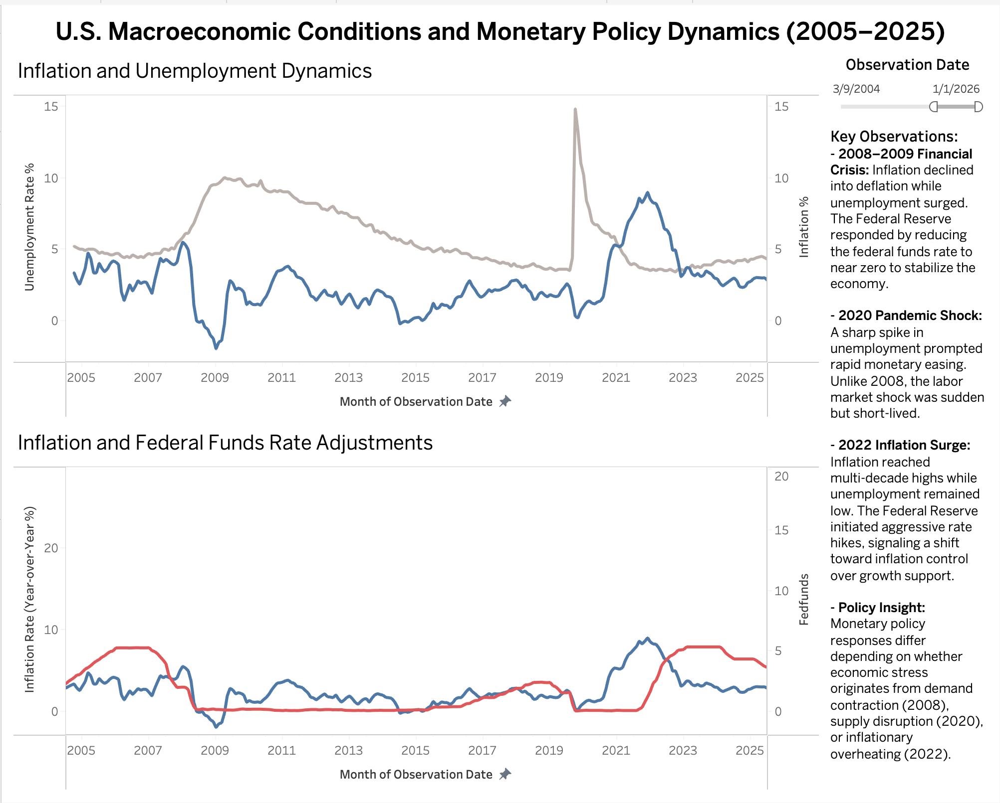

# U.S. Macroeconomic Conditions and Monetary Policy Dynamics (2005–2025)

## Overview

This project presents an interactive Tableau dashboard analyzing the relationship between inflation, unemployment, and the Federal Funds Rate from 2005 to 2025.

Using publicly available data from the Federal Reserve Economic Data (FRED) database, the dashboard examines how U.S. monetary policy responded across major economic periods, including the 2008 financial crisis, the 2020 pandemic shock, and the 2022 inflation surge.

The objective of this project is to explore how macroeconomic conditions influence monetary policy decisions and to identify differences in policy responses across distinct economic regimes.

---

## Dashboard Preview

---

## Key Findings

- **2008–2009 Financial Crisis:** Inflation declined into deflation while unemployment rose sharply. The Federal Reserve reduced the federal funds rate to near zero to support economic stabilization.

- **2020 Pandemic Shock:** A sudden spike in unemployment prompted rapid monetary easing. Unlike the financial crisis, the labor market shock was abrupt but short-lived.

- **2022 Inflation Surge:** Inflation reached multi-decade highs while unemployment remained relatively low. The Federal Reserve responded with aggressive rate hikes, signaling a shift toward inflation control.

- Monetary policy responses differ depending on whether economic stress originates from demand contraction, supply disruption, or inflationary overheating.

---

## Data Sources

All data were retrieved from the Federal Reserve Economic Data (FRED) database:

- CPIAUCSL — Consumer Price Index for All Urban Consumers (Bureau of Labor Statistics)
- UNRATE — Civilian Unemployment Rate (Bureau of Labor Statistics)
- FEDFUNDS — Effective Federal Funds Rate (Board of Governors of the Federal Reserve System)

Inflation was calculated as the year-over-year percentage change in the CPI.

---

## Tools & Methods

- Tableau (Data visualization and dashboard development)
- Time-series transformation (Year-over-Year inflation calculation)
- Dual-axis visualization for macroeconomic comparison
- Interactive date filtering for dynamic time-window analysis

---

## Full Dashboard (PDF Version)

[Download Dashboard PDF](macroeconomic-dashboard.pdf)
